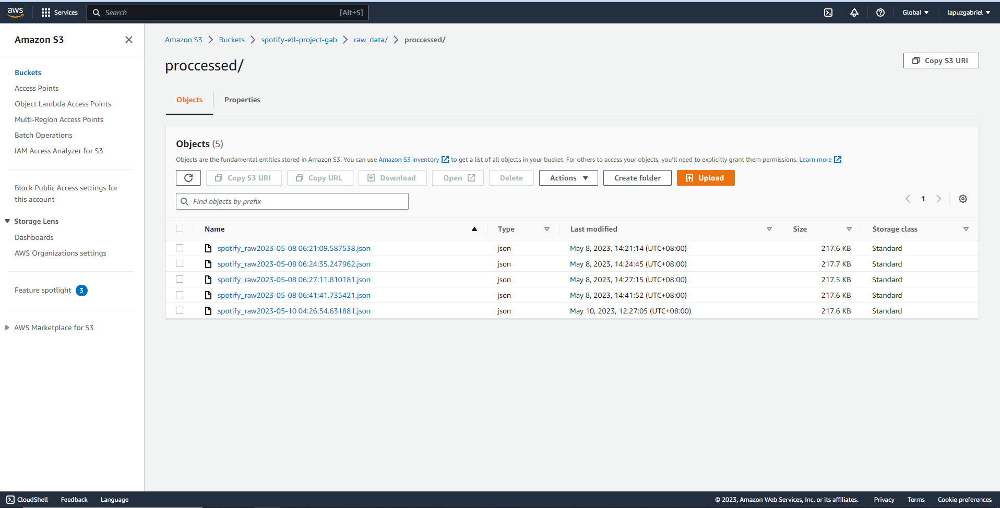

# Spotify-ETL-Pipeline

### Project Overview
This project involves constructing an ETL (Extract, Transform, and Load) pipeline on AWS utilizing the Spotify API. The pipeline will extract data from the Spotify API, transform it into a preferred format, and subsequently load it into a data storage system on AWS.

### Architecture


### About Dataset/API
Utilizing Python with the Spotify API enables interaction with Spotify's vast music collection and user information through the Python programming language. By taking advantage of the API, I effectively retrieved data from a playlist, which includes the music artist, album, and songs - [Spotify API](https://developer.spotify.com/documentation/web-api)

### Services Used
1. **S3 (Simple Storage Service):** AWS S3 is a storage service provided by Amazon Web Services. It allows you to store and retrieve data online. Think of it as a virtual storage space where you can save files, like photos or documents, and access them from anywhere using the internet.

2. **AWS Lambda:** AWS Lambda is a service by Amazon Web Services that lets you run your code without managing servers. You just provide the code, and Lambda takes care of the rest, automatically scaling and executing it in response to events, like a user clicking a button. It's a simple, cost-effective way to build and run applications in the cloud.

3. **Cloud Watch:** AWS CloudWatch is a monitoring service by Amazon Web Services that helps you track your cloud resources and applications. It collects data like performance metrics and logs, allowing you to easily analyze, set alarms, and troubleshoot issues. CloudWatch helps you keep an eye on your cloud infrastructure to ensure it's running smoothly and efficiently.

4. **Glue Crawler:** AWS Glue Crawler is a service by Amazon Web Services that automatically scans and catalogs your data stored in various sources. It identifies the structure and properties of your data, creating a metadata table for easy querying and analysis. Think of it as a smart detective that organizes your data, making it simple to find, understand, and use in your cloud-based applications.

5. **Data Catalog:** AWS Data Catalog is a service by Amazon Web Services that helps you organize, discover, and manage your data across various sources. It acts as a central repository for storing metadata, like table definitions and data types, making it easy to find, understand, and use your data in cloud-based applications. Think of it as a librarian that keeps your data organized and accessible, streamlining data analysis and collaboration.

6. **AWS Athena:** AWS Athena is a query service by Amazon Web Services that allows you to analyze data stored in S3 using SQL-like queries. It's a serverless service, meaning you don't need to manage any infrastructure. With Athena, you can easily explore and analyze your data without having to move or preprocess it. It's a fast, cost-effective way to gain insights from your data directly in the cloud.

### Install Packages
```
pip install pandas
pip install numpy
pip install spotipy
```

### Project Execution Flow
Extract Data from API -> Lambda Trigger -> Run Extract Code -> Store Raw Data -> Trigger Transform Function -> Transform Data and Load it -> Query it using Athena

### Part 1: Extraction
* The page used for data extraction using Spotify API is: **[Playlist, Top Songs - Philippines](https://open.spotify.com/playlist/37i9dQZEVXbJVKdmjH0pON?si=6056369be0654082&nd=1)**
* The python library used for data extraction is Spotipy, raw data extracted is in JSON format.
* Deploy that data extraction code on AWS Lambda Function.
* Run daily Trigger using CloudWatch to Automate.
* Raw data was loaded to the S3 bucket using boto3.
* You can see the full and detailed script **[HERE](https://github.com/gabrieljerdhy/spotify-etl-pipeline/blob/main/code/extract.py)**:

.png)

### Part 2: Transform
* Incorporate an S3 trigger that will activate whenever new data is added to the S3 bucket.
* Utilize AWS Lambda to implement the logic for transforming the data.
* The transformed data is placed back into the S3 bucket.
* You can see the full and detailed script **[HERE](https://github.com/gabrieljerdhy/spotify-etl-pipeline/blob/main/code/load_and_transform.py)**:

.png)

### Part 3: Load
* Create Glue Crawler to infer schema when new data arrives in S3.
* Create AWS Data Catalog to manage metadata repository.
* Use Amazon Athena for querying final dataset.


